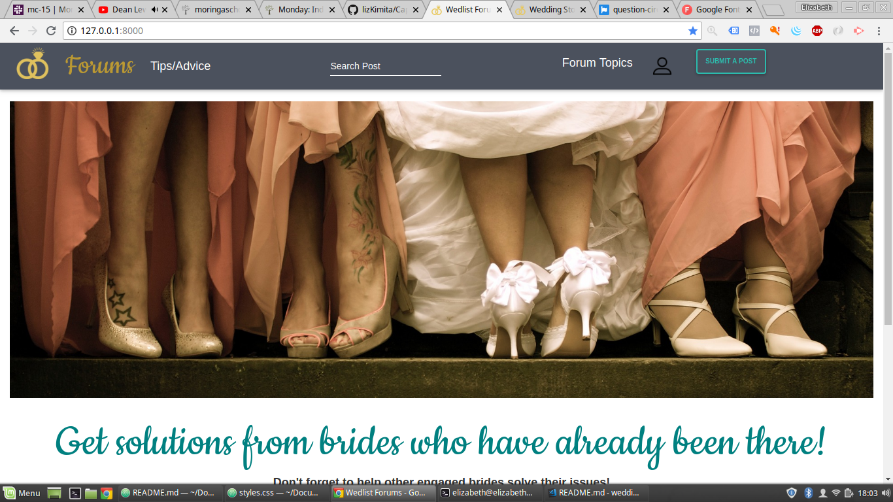

# Wedlist Forums

#### Wedlist Forums provides a platform for newly engaged brides to connect with other brides as well as those who have gone through that stage before them, 05/06/2019

#### By **Elizabeth Wanjiku Kimita**

## Description
This is an application that provides a platform for brides to air out the issues they are facing while planning their weddings, and have other brides or those who are already married to offer their solutions. Brides can give each other tips/ advice on what they know having been there and other users can upvote or downvote the tips given depending on how useful they are.

## BDD Specifications
| User Requirements                                      | Input                                                                                                                         | Output                                                                                                           |
|--------------------------------------------------------|-------------------------------------------------------------------------------------------------------------------------------|------------------------------------------------------------------------------------------------------------------|
| Sign up/Login                                          | To create a new account click the sign up link and fill the form details To login click the login button and fill the details | If login is successful user is navigated to the home page and can view all the posts by other users.             |
| To create a profile                                    | Click the profile tab and create a new profile.                                                                               | New profile for the user will be created.                                                                        |
| To see all posts/ queries                              | Navigate to the home page and all posts will be displayed.                                                                    | All posts from different users will be displayed.                                                                |
| To add a new post                                      | Click the create post tab on the navbar and submit your new post details.                                                     | Your new post will be displayed on the home page.                                                                |
| To add a new tip                                       | Click the Tips/Advice tab on the navbar and create a new tip/piece of advice                                                  | Your new tip/piece of advice will be listed on the tips page.                                                    |
| To edit your profile/Change your status                | On the profile page click the edit profile button, make the changes and submit                                                | Profile and status will be edited.                                                                               |
| To view the posts and tips you have created so far     | Navigate to your profile page and all your posts and tips will be listed there.                                               | All your posts and tips are visible in the profile page                                                          |
| To offer a solution to a raised issue                  | On the home page click the offer solution button on a specific post.                                                          | You will be navigated to a page with all the offered solution if any, you can then add your solution from there. |
| To up vote/down vote on an offered tip/piece of advice | On the tips page click the up vote icon if you like a tip and the down vote icon if you do not like it.                       | Your vote will be added to the total up vote/ down vote count and the total displayed.                           |
| To log out                                             | Click the profile icon and then the logout link                                                                               | You will be logged out                                                                                           |

## Setup/Installation Requirements
* Ensure you have Installed Python3.6
* Clone the Wedlist-Forums Repository
* Create and Activate your virtual environment - `python3.6 -m venv --without-pip virtual` && `source virtual/bin/activate`
* Install dependencies - `pip install -r requirements.txt`
* Create a Database - `psql` then `CREATE DATABASE database name`
* Run Migrations - `python3.6 manage.py makemigrations database name` then `python3.6 manage.py migrate`
* Run the App - `python3.6 manage.py runserver`
* Application should open on `localhost:8000` 

## Known Bugs
There are currently no known bugs.

## Technologies Used
* Python 3.6
* Bootstrap
* Heroku
* HTML
* CSS
* Django

## Support and contact details
For more information, questions, or help using the program, get in touch with me on +254 726 047102 or email: kimita.wanjiku@gmail.com.

### License
MIT
Copyright (c) 2019 **Elizabeth Wanjiku Kimita**
  